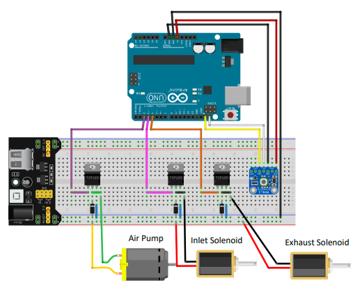
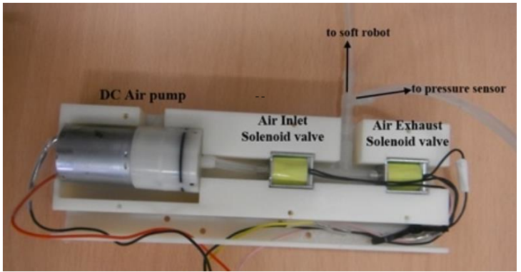

## Table of contents

{: .no_toc .text-delta }

1. TOC
{: toc }


# Lab 2 Overview


**Building an Electro-Pneumatic Control Circuit 建立一种电-气控制电路**

- Fabrication 组装，装配

  1. Fabricat pneumatic actuator out of either heat weldable fabric(热焊结构) or a plastic bag (do this first so the adhesive has time to set) 制造气动执行机构的可焊织物热(热焊结构)或一个塑料袋(这样做首先胶时间设置)

  2. Solder leads onto your mini-pump 

  3. Assemble pneumatic tubing and electro-mechanical system

  4. Assemble circuit on breadboard and combine with pneumatic system

  5. Upload provided code and run 


**Lab 2 Component List**

-  Mini-pump x1

- - Solenoid valve x2
  - Additional small diameter      tubing
  - Power supply wall adapter x1
  - Breadboard power supply      module x1
  - Transistor x3
  - Diode x3
  - Heat weldable fabric OR      plastic bag

- Communal tools:

- - Fabric adhesive
  - Soldering irons
  - Impulse sealers
  - Hand pumps
  - 

**Wiring Diagram 接线图；布线图**





Note: Make sure the power supply module is plugged in and turned on


**Pneumatic System Setup 气动系统设置**



Notes:

1. Soft Robot” in the diagram will refer to the soft actuator in our lab
2. Additional changes betweensmall and large diameter tubing will be needed to fit components and T-connectors


**Coding**

1. Sample code to run system is available on Blackboard
2. A text file containing the code has also been uploaded in case there are issues with downloading the Arduino file
3. You may need to change the pump/exhaust times in the code to match the capacity of your actuator

```c
#include <Wire.h>
#include <Adafruit_MPRLS.h>

#define RESET_PIN  -1  // set to any GPIO pin # to hard-reset on begin()
#define EOC_PIN    -1  // set to any GPIO pin to read end-of-conversion by pin
Adafruit_MPRLS mpr = Adafruit_MPRLS(RESET_PIN, EOC_PIN);

int pumpPin = 2;
int solenoidInlet = 3;
int solenoidExhaust = 4;

void setup() {
  Serial.begin(115200);
  Serial.println("MPRLS Simple Test");
  if (! mpr.begin()) {
    Serial.println("Failed to communicate with MPRLS sensor, check wiring?");
    while (1) {
      delay(10);
    }
  }
  Serial.println("Found MPRLS sensor");
  
  pinMode(pumpPin, OUTPUT);
  pinMode(solenoidInlet,OUTPUT);
  pinMode(solenoidExhaust,OUTPUT);

  digitalWrite(solenoidInlet, HIGH);
  digitalWrite(solenoidExhaust, LOW);
  digitalWrite(pumpPin, HIGH);
  delay(4000);
  digitalWrite(pumpPin, LOW);
  delay(1000);
}

void loop() {
  float pressure_hPa = mpr.readPressure();
  Serial.print("Pressure (hPa): "); Serial.println(pressure_hPa);
  Serial.print("Pressure (PSI): "); Serial.println(pressure_hPa / 68.947572932);
  delay(5000);
  digitalWrite(solenoidExhaust, HIGH);
}
```


