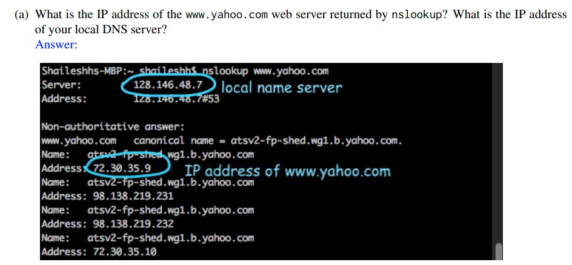
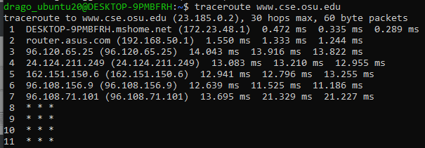
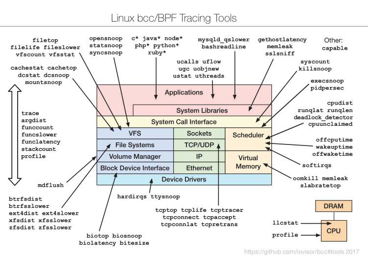
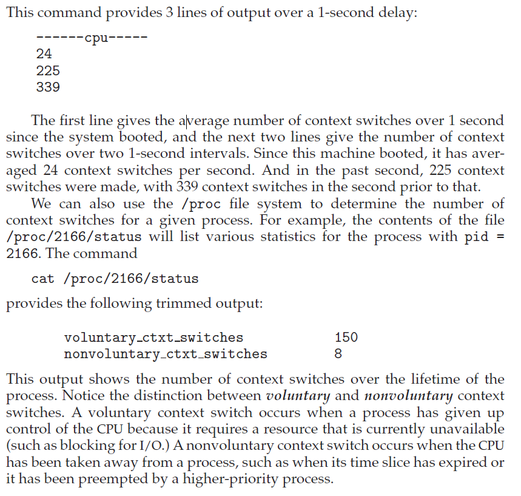

## Table of contents

{: .no_toc .text-delta }

1. TOC
{: toc }


Reference:

- !!! Linux入门教程, http://www.92csz.com/study/linux/
- !!! Basic UNIX commands, http://mally.stanford.edu/~sr/computing/basic-unix.html
- Makefile Tutorial, https://makefiletutorial.com/#fancy-rules
- Linux C编程一站式学习, https://www.csie.nuk.edu.tw/~wuch/course/eef011/


# Setting up a brand new Linux Env

- CTRL-ATL-t  to open an terminal
- Enter the following to install some useful packages (compilers and manual pages) which you’ll need in future labs:

```bash
sudo apt update
sudo apt-get install build-essential
sudo apt-get install manpages-dev
sudo apt-get install manpages-posix-dev
```

To be continue...


# All linux command you will need as SDE

## Disk Space Storage

```bash
# Check File System Disk Space Usage
df
Filesystem      Size  Used Avail Use% Mounted on
05-AU21         932G  300G  632G  33% /media/sf_05-AU21
# 3. Show Disk Space Usage in Human Readable Format
df -h

4. Display Information of /home File System
```

Reference

- https://www.tecmint.com/how-to-check-disk-space-in-linux/


## Network related

```bash
# ------------------ Network related
# Check networking driver and usage ==> That's how you find out your localhost, private ip, and 
$ ifconfig
# (Windows)
ipconfig
ipconfig /all	# With details

# Checking network connection:
ping www.google.com

# query Internet name servers as well as your local name server
$ nslookup www.google.com
Server:         128.146.48.7
Address:        128.146.48.7#53

Non-authoritative answer:
Name:   www.google.com
Address: 142.251.35.164
Name:   www.google.com
Address: 2607:f8b0:4006:807::2004


# Checking Wireless Network Speed, Signal Strength And Other Information
# 1. Find out your Linux wireless card chipset information
lspci
# list network devices including Wi-Fi device on Linux:
sudo lshw -C network


```



**traceroute**:  traceroute is a tool to determine the router-level path between two end hosts on the Internet. To determine the path to a given destination address, say 8.8.8.8, run traceroute as follows traceroute 8.8.8.8 (if you have a windows machine use tracert instead).

`$ traceroute www.cse.osu.edu`

`tracert www.cse.osu.edu` For Windows user




```bash
# Checking all network statistic, such port connection. The netstat command is often used with other networking related Command Prompt commands like nslookup, ping, tracert, ipconfig, and others. See more here, https://www.lifewire.com/netstat-command-2618098

# you might need to run 'sudo apt install net-tools' if you dont have it installed
netstat -bq
# display the process's actual file name. Using -b over -o might seem like it's saving you a step or two but using it can sometimes greatly extend the time it takes netstat to fully execute.
netstat -anp| grep tcp
netstat -s -p tcp -f
# [-f] foreign addresses displayed in FQDN format 
# see protocol specific statistics [-s] but not all of them, just TCP stats [-p tcp]
netstat -e -t 5
# show some basic network interface statistics [-e] 
# and so that these statistics continually updated in the command window every five seconds [-t 5].


ubuntu@ip-172-31-23-71:~$ netstat -nltp
(Not all processes could be identified, non-owned process info
 will not be shown, you would have to be root to see it all.)
Active Internet connections (only servers)
Proto Recv-Q Send-Q Local Address           Foreign Address         State       PID/Program name    
tcp        0      0 0.0.0.0:22              0.0.0.0:*               LISTEN      -                   
tcp        0      0 0.0.0.0:5432            0.0.0.0:*               LISTEN      -                   
tcp        0      0 0.0.0.0:5000            0.0.0.0:*               LISTEN      -                   
tcp        0      0 127.0.0.1:33171         0.0.0.0:*               LISTEN      2658/node           
tcp        0      0 127.0.0.53:53           0.0.0.0:*               LISTEN      -                   
tcp6       0      0 :::22                   :::*                    LISTEN      -                   
tcp6       0      0 :::5432                 :::*                    LISTEN      -                   
tcp6       0      0 :::5000                 :::*                    LISTEN      - 


# For SLURM/PBS in HPC center
qstat

sudo iptables -L ==> Checking all route table

# Set Up a Firewall with UFW on Ubuntu 18.04, https://www.digitalocean.com/community/tutorials/how-to-set-up-a-firewall-with-ufw-on-ubuntu-18-04
sudo ufw status
sudo ufw enable
sudo ufw allow 22
sudo ufw reset


# Fun thing: Testing network speed
wget -O speedtest-cli https://raw.githubusercontent.com/sivel/speedtest-cli/master/speedtest.py
chmod +x speedtest-cli
# Run it with
./speedtest.py
# Reference, https://github.com/sivel/speedtest-cli
```


**Reference:**

- HowTo: Find Out DNS Server IP Address Used By My Router?, https://www.cyberciti.biz/faq/how-to-find-out-dns-for-router/


## System related

```bash

# ------------------ System related
sudo systemctl (system control) restart

# Checking process
ps -A
pstree 	# displays processes in a tree
ps aux 	# More info
# a = show processes for all users
# u = display the process's user/owner
# x = also show processes not attached to a terminal

kill -9 <pid> # Not sure why, but something you need -9 to make it work


passwd 		# lets you change your password, which you should do regularly (at least once a year). 
```


## Resource checking

```bash
# ------------------ Resource checking
# Checking CPU
lscpu
# Check CPU driver and usage(more detailed info)
$ cat /proc/cpuinfo

# Checking Nvidia gpu
$ nvidia-smi

# Display Linux process, e.g., resource(mem, cpu...) usage
top
htop 	# With interactive viewer
jtop	# For jetson nano
```


## Security related
```bash
# ------------------ Security related
ssh <user_name>@<DNS name server>	# Or ssh <user_name>@<IP>

ssh -i id_rsa dong.760@ri2.cse.ohio-state.edu	# With private key, so you don't need password

ssh -vvv jetbot@2.tcp.ngrok.io -p16318	# For debugging

ssh -N -L 8887:p0002.ten.osc.edu:8787 -L 8888:p0002.ten.osc.edu:8888 dong760@pitzer.osc.edu 
# Port forwarding port 8787 at p0002.ten.osc.edu to 8887 at my local address
# Yes you can forward multiple port
```
- -N: I don't want to run a command
- -L: I want to forward a port
- 8787: the default dask dashboard
- 8888: the default jupyter  board
- owens-login01.hpc.osc.edu: The public accessible cluster address
-  8888:owens-login01.hpc.osc.edu:8787: we want to forward the default dask dashboard to 8888 at local port
- Use '$ hostname' command to find out the public cluster address


```bash
$ cd ~/.ssh
$ ls
authorized_keys2  id_dsa       known_hosts
config            id_dsa.pub
$ ssh-keygen -o	# Regular case
$ ssh-keygen -t rsa -b 4096	# Specify certain algorithm

# More: 1) SSH Public Key, https://git-scm.com/book/en/v2/Git-on-the-Server-Generating-Your-SSH-Public-Key
# 2) gpg utility, https://drago1234.github.io/cryptography/2020/06/09/gpg-utility/

# The ssh_config file in client side ==> Use for ssh configuration
~/.ssh/config
# the sshd_config use for server side ssh connection configuration.
/etc/ssh/sshd_config
```


Reference:

- ssh_config usage, https://linux.die.net/man/5/ssh_config
- sshd_config — OpenSSH daemon configuration file, https://man.openbsd.org/sshd_config
-  


## Some Basic Stuff

```bash
# Checking hostname/username
hostname
# or 
echo $HOSTNAME

# ==> Return the directory recursive within 2 nodes 
tree . -L 2	


# How to find files in Linux
$find /home/username/ -name "*.err"		# return any name end with .err under that folder

# Alias
$ alias cf5='cat folio5'

# Ctrl-r: "r" is for reverse search. It's another way to find previous command without having to remember the whole command, and it's more flexible than the bang. ==>  Ctrl-r again will search for next one

# The Exclamation Point: The exclamation point is a way of telling linux you want to recall the last command which matches the text you type after it. So "!c" means recall the last command that starts with the letter c, the "cal" command in this case. 
$ !874	# re-executes the command number 874 in your history.


# Other things
$ whoami
$ cal
$ date 
$ which python	# Checking python.exe path/dir
$ source 	# ==> is a shell built-in command which is used to read and execute the content of a file(generally set of commands), passed as an argument in the current shell script.
$ export 	# ==> It is a bash shell BUILTINS commands, which means it is part of the shell. It marks an environment variables to be exported to child-processes.
chmod +x speedtest-cli
chmod ugo+rwx directory1 设置目录的所有人(u)、群组(g)以及其他人(o)以读（r ）、写(w)和执行(x)的权限

# Files
$ diff filename1 filename2 
$ zip file1.zip file1 创建一个zip格式的压缩包 
$ unzip temp.zip
$ touch file.sh		# Create a newfile
$ mv filename1 filename2 
$ ls -al	# long format, all files
$ wc filename	# tells you how many lines, words, and characters there are in a file

# Open/read file
$ cat file.sh
$ less file.sh
$ emacs file.sh
$ vi file.sh
$ vim file.sh
$ nano file.sh

# (Windows)
code .	#  open VS
notepad	# Open with notepad


# Vim:
0	# Beginning of line
$	# End of line
gg	# First line of file
G	# Last line of file
dd	# delete a line

:qa!	# quit and abandon all changes
:q!		# quit and overwrite/apply all changes
:wq		# write and quit
```


## Performance Monitoring and Tuning

We mentioned earlier that performance tuning seeks to improve performance by removing processing bottlenecks. To identify bottlenecks, we must be able to monitor system performance. Thus, the operating system must have some means of computing and displaying measures of system behavior. Tools may
be characterized as providing either per-process or system-wide observations. To make these observations, tools may use one of two approaches—counters or tracing. We explore each of these in the following sections.

2.10.2.1 Counters
Operating systems keep track of system activity through a series of counters, such as the number of system calls made or the number of operations performed to a network device or disk. The following are examples of Linux tools that use counters:
**Per-Process**
• ps—reports information for a single process or selection of processes
• top—reports real-time statistics for current processes
**System-Wide**
• vmstat—reports memory-usage statistics
• netstat—reports statistics for network interfaces
• iostat—reports I/O usage for disks

Most of the counter-based tools on Linux systems read statistics from the /proc file system. /proc is a “pseudo” file system that exists only in kernel memory and is used primarily for querying various per-process as well as kernel statistics. The /proc file system is organized as a directory hierarchy,
with the process (a unique integer value assigned to each process) appearing as a subdirectory below /proc. For example, the directory entry /proc/2155 would contain per-process statistics for the process with an ID of 2155. There are /proc entries for various kernel statistics as well. In both this chapter and
Chapter 3, we provide programming projects where you will create and access the /proc file system.
Windows systems provide the Windows Task Manager, a tool that includes information for current applications as well as processes, CPU and memory usage, and networking statistics. A screen shot of the task manager inWindows 10 appears in Figure 2.19.

2.10.3 Tracing
Whereas counter-based tools simply inquire on the current value of certain statistics that are maintained by the kernel, tracing tools collect data for a specific event—such as the steps involved in a system-call invocation. The following are examples of Linux tools that trace events:
**Per-Process**
• strace—traces system calls invoked by a process
• gdb—a source-level debugger
**System-Wide**
• perf—a collection of Linux performance tools
• tcpdump—collects network packets



Reference:

- Dragon book(OS Concepts 10th), Chap2.10.2, p96


## More Advance:

**Dispatch Latency**: 

An interesting question to consider is, how often do context switches occur? On a system-wide level, the number of context switches can be obtained by using the vmstat command that is available on Linux systems. Below is the output (which has been trimmed) from the command:

```bash
$ vmstat
procs -----------memory---------- ---swap-- -----io---- -system-- ------cpu-----
 r  b   swpd   free   buff  cache   si   so    bi    bo   in   cs us sy id wa st
 0  0      0 39069548  32788  90876    0    0     2    77    1    4  0  0 100  0  0
$ vmstat 1 3
procs -----------memory---------- ---swap-- -----io---- -system-- ------cpu-----
 r  b   swpd   free   buff  cache   si   so    bi    bo   in   cs us sy id wa st
 0  0      0 39069540  32796  90956    0    0     2    76    1    4  0  0 100  0  0
 0  0      0 39069540  32796  90956    0    0     0     0    4   24  0  0 100  0  0
 0  0      0 39069540  32796  90956    0    0     0     0    4   28  0  0 100  0  0
```




Reference:

- Dragon book, chap 5.1.4, p271


Appendix:

```bash
#
# default .bashrc
# 03/31/13
#
# Source global definitions
if [ -f /etc/bashrc ]; then
	. /etc/bashrc
fi
 
umask 022

# disable coredumps by default
ulimit -c 0

# User specific aliases and functions

alias rm='rm -i'


# ~/.bashrc: executed by bash(1) for non-login shells.
# see /usr/share/doc/bash/examples/startup-files (in the package bash-doc)
# for examples

# If not running interactively, don't do anything
case $- in
    *i*) ;;
      *) return;;
esac

# don't put duplicate lines or lines starting with space in the history.
# See bash(1) for more options
HISTCONTROL=ignoreboth:erasedups HISTSIZE=1000 HISTFILESIZE=2000      # Set up my history file to ignore duplicates and be much larger than the default.

# append to the history file, don't overwrite it
shopt -s histappend

# for setting history length see HISTSIZE and HISTFILESIZE in bash(1)
HISTSIZE=1000
HISTFILESIZE=2000

# check the window size after each command and, if necessary,
# update the values of LINES and COLUMNS.
shopt -s checkwinsize

# If set, the pattern "**" used in a pathname expansion context will
# match all files and zero or more directories and subdirectories.
#shopt -s globstar

# make less more friendly for non-text input files, see lesspipe(1)
[ -x /usr/bin/lesspipe ] && eval "$(SHELL=/bin/sh lesspipe)"

# set variable identifying the chroot you work in (used in the prompt below)
if [ -z "${debian_chroot:-}" ] && [ -r /etc/debian_chroot ]; then
    debian_chroot=$(cat /etc/debian_chroot)
fi

# set a fancy prompt (non-color, unless we know we "want" color)
case "$TERM" in
    xterm-color|*-256color) color_prompt=yes;;
esac

# uncomment for a colored prompt, if the terminal has the capability; turned
# off by default to not distract the user: the focus in a terminal window
# should be on the output of commands, not on the prompt
#force_color_prompt=yes

if [ -n "$force_color_prompt" ]; then
    if [ -x /usr/bin/tput ] && tput setaf 1 >&/dev/null; then
	# We have color support; assume it's compliant with Ecma-48
	# (ISO/IEC-6429). (Lack of such support is extremely rare, and such
	# a case would tend to support setf rather than setaf.)
	color_prompt=yes
    else
	color_prompt=
    fi
fi

if [ "$color_prompt" = yes ]; then
    PS1='${debian_chroot:+($debian_chroot)}\[\033[01;32m\]\u@\h\[\033[00m\]:\[\033[01;34m\]\w\[\033[00m\]\$ '
else
    PS1='${debian_chroot:+($debian_chroot)}\u@\h:\w\$ '
fi
unset color_prompt force_color_prompt

# If this is an xterm set the title to user@host:dir
case "$TERM" in
xterm*|rxvt*)
    PS1="\[\e]0;${debian_chroot:+($debian_chroot)}\u@\h: \w\a\]$PS1"
    ;;
*)
    ;;
esac

# enable color support of ls and also add handy aliases
if [ -x /usr/bin/dircolors ]; then
    test -r ~/.dircolors && eval "$(dircolors -b ~/.dircolors)" || eval "$(dircolors -b)"
    alias ls='ls --color=auto'
    #alias dir='dir --color=auto'
    #alias vdir='vdir --color=auto'

    alias grep='grep --color=auto'
    alias fgrep='fgrep --color=auto'
    alias egrep='egrep --color=auto'
fi

# colored GCC warnings and errors
#export GCC_COLORS='error=01;31:warning=01;35:note=01;36:caret=01;32:locus=01:quote=01'

# some more ls aliases
export CLICOLOR=1
export LANG="en_US.UTF-8"
alias ll='ls -alF'
alias la='ls -A'
alias l='ls -CF'
alias cp="cp -i"
alias ls="ls --color=auto"
# export PS1="\[\033[01;32m\]\u@\h\[\033[00m\]:\[\033[01;34m\]\w\[\033[00m\]\$ "
# set -o vi                                       # Set vi as the editor at the command line
export EDITOR="vim"                              # Set vi as the default editor

# Add an "alert" alias for long running commands.  Use like so:
#   sleep 10; alert
alias alert='notify-send --urgency=low -i "$([ $? = 0 ] && echo terminal || echo error)" "$(history|tail -n1|sed -e '\''s/^\s*[0-9]\+\s*//;s/[;&|]\s*alert$//'\'')"'

# Alias definitions.
# You may want to put all your additions into a separate file like
# ~/.bash_aliases, instead of adding them here directly.
# See /usr/share/doc/bash-doc/examples in the bash-doc package.

if [ -f ~/.bash_aliases ]; then
    . ~/.bash_aliases
fi

# enable programmable completion features (you don't need to enable
# this, if it's already enabled in /etc/bash.bashrc and /etc/profile
# sources /etc/bash.bashrc).
if ! shopt -oq posix; then
  if [ -f /usr/share/bash-completion/bash_completion ]; then
    . /usr/share/bash-completion/bash_completion
  elif [ -f /etc/bash_completion ]; then
    . /etc/bash_completion
  fi
fi

# ================================> Customized Section: @author: Drago, @date: 08/18/2021
# For docker, https://newbedev.com/docker-got-permission-denied-while-trying-to-connect-to-the-docker-daemon-socket-at-unix-var-run-docker-sock-post-http-2fvar-2frun-2fdocker-sock-v1-24-containers-create-dial-unix-var-run-docker-sock-connect-permission-denied-code-example
# sudo chmod 666 /var/run/docker.sock

# =============================== Hardware or pertinent Environment Checking
date
# echo "==========================> Checking Disk Usage"
# df -h
# ==> Return the directory recursive within 2 nodes 
# tree . -L 2	
# echo "==========================> Checking Network connection"
# netstat -anp| grep tcp
# ifconfig
echo "===========================> Checking OS Information"
lsb_release -a
uname -m && cat /etc/*release
echo "===========================> Checking CPU Information"
lscpu
# Check you have GPU driver installed
echo "===========================> Checking GPU Configuration"
nvidia-smi		
# Checking you have CUDA compiler
nvcc --version	

uname -arv

echo "==========================> Loading Interactive computing node"
# qrsh -P dl523 -l gpus=1 -l gpu_c=3.5

## Some routine command for activating conda tensorflow pytorch with cuda support
# echo "==========================> Activate conda tensorflow env"
module load python3/3.8.10
module load tensorflow/2.5.0
module load pytorch/1.9.0
module load opencv/4.5.0
module load cuda/11.1
module load pandoc/2.5
module load texlive/2018
# module load miniconda/4.9.2

# If you don't have miniconda, run the following code
# curl -O https://repo.anaconda.com/miniconda/Miniconda3-latest-Linux-x86_64.sh
# sh Miniconda3-latest-Linux-x86_64.sh

# source ~/miniconda3/bin/activate
# export PATH=/projectnb/dl523/students/dong760/miniconda3/envs/tf_latest/bin:$PATH
# export PATH=/projectnb/dl523/students/dong760/miniconda3/condabin:$PATH 

# source /projectnb/dl523/students/dong760/miniconda3/bin/activate
source ~/miniconda3/bin/activate
export PYTHONNOUSERSITE=true
conda activate dl_env
which python
# conda activate tf_latest
# module list

# Verify the installation:
# >>> import torch
# >>> import tensorflow as tf
# >>> torch.cuda.is_available()
# True
# >>> tf.test.gpu_device_name()
# '/device:GPU:0'

### Some Alias command
# Remember to activate it with command: $ source ~/.bashrc
# alias python=/usr/bin/python3
# alias python=~/miniconda3/bin/python3.9
# alias python=/projectnb/dl523/students/dong760/miniconda3/envs/tf_latest/bin/python
alias pip=pip3
alias open="explorer.exe"
alias pbcopy="clip.exe"
alias ll="ls -lt"

### Some package installation command
# pip install tensorflow
# conda install jupyterlab scipy matplotlib
# conda install pytorch torchvision torchaudio cudatoolkit=11.2 -c pytorch
# conda list --explicit > bio-env.txt
# conda env export > puppies.yml        # Save current environment to a file
# conda env create -f puppies.yml       # Load environment from a file
# conda info -e                         # Get a list of all my environments, active environment shown with *
# conda create -n bunnies python=3.4    # Create a new environment, specify Python version
# conda create -n flowers --clone snowflakes # Make exact copy of an environmen
# conda remove --name snakes --all      # Remove an environmen
# cnda clean -a                         # Remove all conda cache,
# More reference: 1) https://docs.conda.io/projects/conda/en/latest/commands.html 2) https://www.bu.edu/tech/support/research/software-and-programming/common-languages/python/anaconda/#exp2

### Other common utility command
# cp -R ~/miniconda3 /projectnb/dl523/students/dong760      # How to copy folder recusively
# zip -r <output_file> <folder_1> <folder_2> ... <folder_n> # Zip multiple folder

echo "==========================> Checking SCC Quota Usage"
pquota dl523
quota -s
qstat -u dong760
# which python
# module list

```


